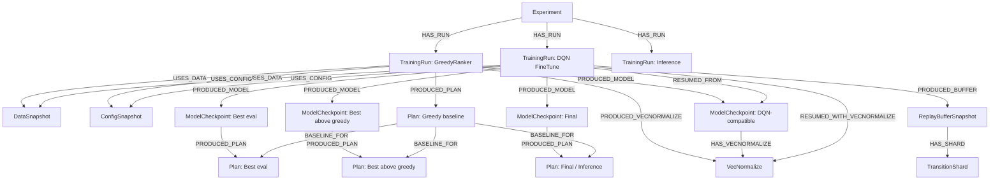
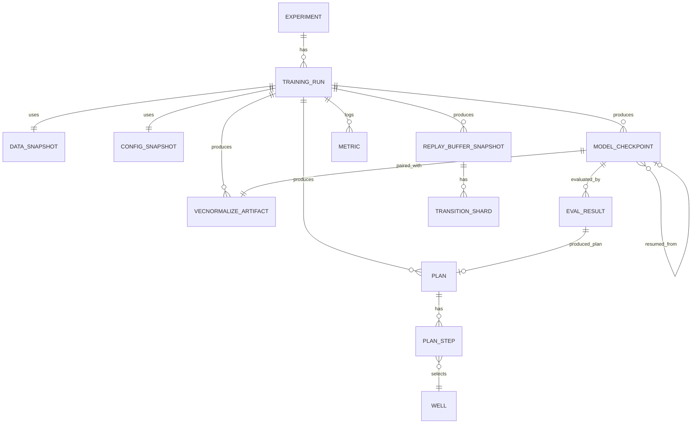

# Графовое хранилище для моделей, планов и replay buffer

## 1. Назначение
Графовое хранилище фиксирует историю обучения и связи между данными, запусками, весами модели, VecNormalize, replay buffer, метриками и построенными планами.

```text
граф = связи, метаданные, lineage, поиск
файловое хранилище = .pt, .pkl, .npz, .csv, .json, .parquet
```

Граф отвечает на вопросы: какая модель от какой обучалась, каким checkpoint построен план, какая версия VecNormalize нужна к модели, какой replay buffer использовался, какие планы лучше greedy baseline.

## 2. Общая архитектура
```text
Neo4j / Memgraph / ArangoDB
  хранит узлы, связи и метаданные

artifacts/
  хранит веса, планы, buffer, summary, CSV и конфиги
```

Пример структуры:
```text
graph_storage/
  artifacts/
    experiments/
      exp_303_full_plan/
        greedy_ranker/
        dqn_finetune/
        plans/
        buffers/
        configs/
        metrics/
```

## 3. Что хранится в графе
Основные узлы:
```text
Experiment
TrainingRun
DataSnapshot
ConfigSnapshot
ModelCheckpoint
VecNormalizeArtifact
ReplayBufferSnapshot
TransitionShard
Plan
PlanStep
Well
Metric
EvalResult
```

В графе хранятся идентификаторы, типы, пути к файлам, checksum, размеры файлов, параметры запуска, метрики и связи между сущностями.

## 4. Что хранится файлами
```text
model.pt
vecnormalize.pkl
replay_buffer.npz
transition_shard_0001.parquet
plan.json
plan_steps.parquet
training_episode_results.csv
training_loss_history.csv
checkpoint_history.csv
summary.json
config.json
```

Для каждого файла в графе хранить: `path`, `artifact_uri`, `artifact_type`, `checksum`, `size_bytes`, `created_at`.

## 5. Graph-схема


## 6. ER-схема


## 7. Основные сущности
| Сущность | Что хранит |
|---|---|
| `Experiment` | общий эксперимент: id, name, description, created_at |
| `TrainingRun` | запуск скрипта: run_id, script_name, stage, output_dir, seed, status |
| `DataSnapshot` | версию данных: пути к Excel/профилям, число скважин, checksum |
| `ConfigSnapshot` | параметры запуска: тип конфига, путь к JSON, hash |
| `ModelCheckpoint` | веса модели: путь, тип checkpoint, n_actions, obs_dim, NPV, размер плана |
| `VecNormalizeArtifact` | файл нормализации: путь, norm_obs, norm_reward, checksum |
| `ReplayBufferSnapshot` | снимок buffer: путь, формат, размер, число episodes/transitions |
| `TransitionShard` | часть buffer в отдельном файле |
| `Plan` | построенный план: тип, размер, NPV, gap к greedy, путь к JSON |
| `PlanStep` | шаг плана: номер, action, скважина, даты, cost, reward |
| `Well` | скважину: имя, куст, дебиты, длину, дату ввода |
| `Metric` | метрику обучения: имя, значение, step, episode |
| `EvalResult` | deterministic eval: NPV, размер плана, gap к greedy |

Примеры `pipeline_stage`: `greedy_ranker`, `dqn_finetune`, `inference`.
Примеры `checkpoint_kind`: `greedy_ranker`, `dqn_compatible_export`, `best_eval`, `best_above_greedy`, `final`, `periodic`.
Примеры `plan_kind`: `greedy_baseline`, `best_eval`, `best_above_greedy`, `final`, `inference`.

## 8. MVP-схема
Для первой версии достаточно:
```text
TrainingRun
ModelCheckpoint
VecNormalizeArtifact
Plan
ReplayBufferSnapshot
```

Минимальные связи:
```text
TrainingRun --PRODUCED_MODEL--> ModelCheckpoint
TrainingRun --PRODUCED_VECNORMALIZE--> VecNormalizeArtifact
ModelCheckpoint --HAS_VECNORMALIZE--> VecNormalizeArtifact
TrainingRun --PRODUCED_PLAN--> Plan
ModelCheckpoint --PRODUCED_PLAN--> Plan
TrainingRun --PRODUCED_BUFFER--> ReplayBufferSnapshot
```

## 9. Индексы Neo4j
```cypher
CREATE CONSTRAINT run_id IF NOT EXISTS FOR (n:TrainingRun) REQUIRE n.run_id IS UNIQUE;
CREATE CONSTRAINT checkpoint_id IF NOT EXISTS FOR (n:ModelCheckpoint) REQUIRE n.checkpoint_id IS UNIQUE;
CREATE CONSTRAINT vecnormalize_id IF NOT EXISTS FOR (n:VecNormalizeArtifact) REQUIRE n.vecnormalize_id IS UNIQUE;
CREATE CONSTRAINT plan_id IF NOT EXISTS FOR (n:Plan) REQUIRE n.plan_id IS UNIQUE;
CREATE CONSTRAINT buffer_id IF NOT EXISTS FOR (n:ReplayBufferSnapshot) REQUIRE n.buffer_id IS UNIQUE;
CREATE INDEX plan_final_npv IF NOT EXISTS FOR (n:Plan) ON (n.final_npv);
```

## 10. Типовые запросы
Лучший план выше greedy:
```cypher
MATCH (p:Plan)
WHERE p.plan_kind = 'best_above_greedy'
RETURN p.plan_id, p.final_npv, p.gap_vs_greedy, p.path_json
ORDER BY p.gap_vs_greedy DESC
LIMIT 10;
```

Checkpoint для лучшего плана:
```cypher
MATCH (m:ModelCheckpoint)-[:PRODUCED_PLAN]->(p:Plan)
WHERE p.plan_kind = 'best_above_greedy'
RETURN m.checkpoint_id, m.path, p.final_npv, p.gap_vs_greedy
ORDER BY p.gap_vs_greedy DESC
LIMIT 1;
```

VecNormalize для checkpoint:
```cypher
MATCH (m:ModelCheckpoint {checkpoint_id: $checkpoint_id})-[:HAS_VECNORMALIZE]->(v:VecNormalizeArtifact)
RETURN m.path AS model_path, v.path AS vecnormalize_path;
```

## 11. Python API
Рекомендуемый модуль: `src/storage/graph_store.py`.

```python
class GraphArtifactStore:
    def start_run(self, ...): ...
    def finish_run(self, ...): ...
    def register_checkpoint(self, ...): ...
    def register_vecnormalize(self, ...): ...
    def register_plan(self, ...): ...
    def register_replay_buffer(self, ...): ...
    def register_metric(self, ...): ...
    def register_eval_result(self, ...): ...
    def get_best_checkpoint(self, ...): ...
    def get_paths_for_inference(self, ...): ...
```

## 12. Где встраивать
После GreedyRanker сохранять: `TrainingRun`, greedy baseline plan, DQN-compatible checkpoint, VecNormalize, metrics.

После DQN fine-tune сохранять: `TrainingRun`, resume-связь от greedy checkpoint, replay buffer snapshot, best eval checkpoint, best above greedy checkpoint, final checkpoint, планы и метрики.

После inference сохранять: inference run, использованный checkpoint, VecNormalize, построенный план, final NPV и plan size.

## 13. Порядок внедрения
1. Сделать `GraphArtifactStore`.
2. Добавить регистрацию `TrainingRun`.
3. Добавить регистрацию checkpoint и VecNormalize.
4. Добавить регистрацию построенных планов.
5. Добавить регистрацию replay buffer snapshot.
6. Добавить запрос `get_best_checkpoint`.
7. Использовать `get_best_checkpoint` в inference pipeline.

## 14. Главный принцип
Файлы остаются файлами. Граф хранит происхождение и связи: что было обучено, от чего было обучено, на каких данных, с какими параметрами, какой buffer использовался, какой план получился и лучше ли он greedy baseline.
